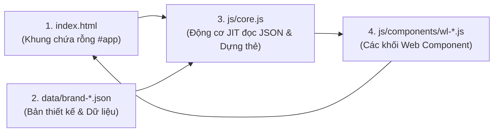

# HƯỚNG DẪN KIẾN TRÚC JIT (JUST-IN-TIME) SIÊU DỄ HIỂU
## Dự Án Website Cuộc Thi: Giáo Dục & Nghề Nghiệp (Nhóm 3 Người)

> **Mục tiêu của tài liệu này:** Giải thích bản chất kiến trúc **JIT (Just-in-Time)** một cách đơn giản, trực quan và dễ hiểu nhất để cả 3 thành viên trong nhóm đều nắm vững và tự tin thuyết trình trước Ban Giám Khảo vào ngày 11/10.

---

## 1. JIT (JUST-IN-TIME) TRONG DỰ ÁN NÀY LÀ GÌ?

### So sánh trực quan:

| Đặc điểm | Cách viết HTML tĩnh truyền thống (Slide 14) | Cách JIT (Dự án này đang áp dụng) |
|---|---|---|
| **Trong `index.html`** | Phải gõ sẵn toàn bộ 11 thẻ `<wl-header>`, `<wl-hero>`, `<wl-cards>`... | **Chỉ có 1 dòng duy nhất:** `<div id="app"></div>` |
| **Ai quyết định bố cục?** | File `index.html` bị cố định cứng thứ tự từ trên xuống dưới. | **File JSON quyết định hoàn toàn** qua mảng `pages.home`. |
| **Đổi thứ tự section?** | Cả 3 thương hiệu bị ép chung 1 bố cục, không đổi riêng được. | Muốn Brand B đảo vị trí hay bỏ bớt section? **Chỉ cần sửa file JSON của Brand B**. |
| **Tối ưu nạp file (Performance)** | Trình duyệt phải nạp tất cả các file JS của mọi component. | Trang chỉ `import` đúng những component nào được khai báo trong JSON. |

> **Định nghĩa đơn giản:** **JIT (Just-in-Time)** nghĩa là **"Đến đâu dựng đến đó"**. File HTML là một khung tranh trống (`#app`). File JSON là bản thiết kế. File `core.js` đọc bản thiết kế và xếp các khối Custom Element `<wl-*>` vào khung tranh đúng lúc chạy trên trình duyệt.

---

## 2. TAM GIÁC CỐT LÕI CỦA KIẾN TRÚC JIT

Kiến trúc JIT vận hành chỉ xoay quanh 3 thành phần chính:



### Thành phần 1: File HTML (`index.html`) — Khung chứa siêu gọn
Chỉ đóng vai trò là vỏ bọc rỗng và gọi `core.js`:
```html
<!DOCTYPE html>
<html lang="vi">
<head>
  <meta charset="UTF-8">
  <link rel="stylesheet" href="css/base.css">
  <link rel="stylesheet" href="css/components.css">
</head>
<body data-page="home">
  <!-- Toàn bộ giao diện sẽ được core.js tự động nhét vào đây -->
  <div id="app"></div>

  <script type="module" src="js/core.js"></script>
  <script src="js/app.js"></script>
</body>
</html>
```

### Thành phần 2: File JSON (`data/brand-a.json`) — Bản thiết kế
Chứa 3 phần dữ liệu:
1. `theme`: Màu chủ đạo, font chữ.
2. `pages.home`: **Danh sách các section cần dựng** (theo đúng thứ tự muốn hiển thị).
3. Các khóa dữ liệu nội dung (`programs`, `features`, `steps`, `stats`...).

```json
{
  "name": "CodeNest",
  "theme": { "colorPrimary": "#1d4ed8", "fontHeading": "Plus Jakarta Sans" },
  "pages": {
    "home": [
      { "type": "header" },
      { "type": "hero" },
      { "type": "cards", "source": "programs", "title": "Khóa học lập trình" },
      { "type": "features", "source": "features" },
      { "type": "steps", "source": "steps" },
      { "type": "stats", "source": "stats" },
      { "type": "faq", "source": "faq", "limit": 4 },
      { "type": "contact" },
      { "type": "footer" },
      { "type": "sticky-cta" }
    ]
  },
  "programs": [ ... ],
  "features": [ ... ]
}
```

### Thành phần 3: Động cơ điều phối (`js/core.js`) — Trái tim của JIT
`core.js` thực hiện tuần tự 4 bước rất mạch lạc:
1. **Bước 1:** Đọc URL xem đang chọn thương hiệu nào (`?brand=brand-a`), sau đó `fetch('data/' + brand + '.json')`.
2. **Bước 2:** Bơm mã màu và font chữ vào biến CSS `:root` (`--color-primary`, `--font-heading`).
3. **Bước 3 (Vòng lặp JIT):** Duyệt qua mảng `data.pages.home`:
   ```javascript
   for (const sec of data.pages.home) {
     // 1. Chỉ nạp đúng file JS của component này
     await import(`./components/wl-${sec.type}.js`);

     // 2. Tạo thẻ HTML tương ứng: <wl-header>, <wl-cards>...
     const el = document.createElement(`wl-${sec.type}`);

     // 3. Đưa cấu hình hiển thị và dữ liệu vào thẻ
     el.config = sec;
     el.data = sec.source ? data[sec.source] : data;

     // 4. Nhét thẻ vào #app
     appEl.appendChild(el);
   }
   ```
4. **Bước 4:** Tạo thanh chọn **Brand Switcher** ở góc màn hình để tiện đổi cấu hình khi demo cho giám khảo.

---

## 3. MẪU CHUẨN VIẾT MỘT COMPONENT THEO JIT (TEMPLATE 20 DÒNG)

Tất cả các component trong thư mục `js/components/` (`wl-header`, `wl-hero`, `wl-cards`...) đều tuân theo **1 khuôn mẫu duy nhất** siêu dễ hiểu:

```javascript
/**
 * js/components/wl-vidu.js
 */
class WlVidu extends HTMLElement {
  // Trình duyệt tự gọi hàm này ngay khi phần tử được append vào DOM
  connectedCallback() {
    this.render();
  }

  render() {
    // 1. Lấy dữ liệu và cấu hình đã được core.js gán vào
    const data = this.data;
    const config = this.config || {};

    // 2. Bảo vệ: Nếu dữ liệu trống thì không vẽ (tránh lỗi sập trang)
    if (!data) return;

    // 3. Render HTML giao diện
    this.innerHTML = `
      <section class="section-wrapper">
        <div class="container">
          <h2 class="section-title">${config.title || 'Tiêu đề mặc định'}</h2>
          <p>${data.moTa || ''}</p>
        </div>
      </section>
    `;
  }
}

// Đăng ký tên thẻ với trình duyệt
customElements.define('wl-vidu', WlVidu);
export default WlVidu;
```

### 2 Quy tắc vàng khi viết Component:
1. **Không ghi cứng nội dung:** Toàn bộ chữ viết, ảnh lấy từ `this.data` hoặc `this.config`.
2. **Không ghi cứng mã màu:** Trong CSS, chỉ dùng `var(--color-primary)`, `var(--color-bg)` để khi đổi sang Brand khác, màu sắc tự đổi theo.

---

## 4. DANH SÁCH 11 COMPONENT TRONG DỰ ÁN (MÔ HÌNH PREPEDU)

| Tên Component | File mã nguồn | Ý nghĩa & Dữ liệu hiển thị |
|---|---|---|
| `<wl-header>` | `js/components/wl-header.js` | Logo, Menu dropdown đa cấp, Nút đăng ký, Menu mobile drawer. |
| `<wl-hero>` | `js/components/wl-hero.js` | Banner lớn, Tiêu đề chính, 2 nút CTA, Thẻ nổi thống kê (`floating-pill`), Avatars học viên. |
| `<wl-cards>` | `js/components/wl-cards.js` | Lưới khóa học (`auto-fit`), Badge nổi bật, Thời lượng, Cấp độ, Giá tiền. |
| `<wl-features>` | `js/components/wl-features.js` | Phương pháp học so le trái/phải (đánh số 01/02/03), gạch đầu dòng tính năng. |
| `<wl-steps>` | `js/components/wl-steps.js` | 3 Bước học: Đánh giá năng lực → Học tương tác → Nhận việc/thành công. |
| `<wl-stats>` | `js/components/wl-stats.js` | Bảng số liệu đầu ra (Tỷ lệ đỗ, Lương khởi điểm, Số học viên, Đối tác). |
| `<wl-testimonials>` | `js/components/wl-testimonials.js` | Lời nhận xét của học viên, Avatar, Chức danh & Công ty đang làm việc. |
| `<wl-faq>` | `js/components/wl-faq.js` | Khối hỏi đáp Accordion (dùng native `<details>/<summary>`), có tùy chọn `limit`. |
| `<wl-contact>` | `js/components/wl-contact.js` | Khối liên hệ (Hotline, Email, Địa chỉ) + Form đăng ký có validate và alert thành công. |
| `<wl-footer>` | `js/components/wl-footer.js` | Chân trang đa cột: Giới thiệu thương hiệu, Danh mục khóa học, Liên kết & Copyright. |
| `<wl-sticky-cta>` | `js/components/wl-sticky-cta.js` | Thanh kêu gọi hành động ghim đáy màn hình khi cuộn. |

---

## 5. PHÂN CHIA CODE & CÔNG VIỆC NHÓM 3 NGƯỜI

Để tránh bị xung đột Git (conflict) khi làm bài:

- **Người 1 (Phụ trách Visual & CSS):**
  - Chịu trách nhiệm: `css/base.css` (tokens, biến màu, font, reset) và `css/components.css` (bố cục responsive).
  - Nhiệm vụ: Đảm bảo giao diện đẹp, co giãn tốt trên Mobile / Tablet / Desktop, font chữ và khoảng cách hài hòa.

- **Người 2 (Phụ trách Core Engine & Logic JIT):**
  - Chịu trách nhiệm: `index.html`, `js/core.js`, `js/app.js`, `wl-header.js`, `wl-contact.js`, `wl-sticky-cta.js`.
  - Nhiệm vụ: Xử lý nạp JSON, JIT loop, đổi theme, validate form đăng ký, menu mobile drawer, và Brand Switcher.

- **Người 3 (Phụ trách Dữ liệu & Thẻ Nội Dung):**
  - Chịu trách nhiệm: `data/brand-a.json`, `data/brand-b.json`, `data/brand-c.json`, `wl-cards.js`, `wl-features.js`, `wl-steps.js`, `wl-stats.js`, `wl-testimonials.js`, `wl-faq.js`, `wl-footer.js`.
  - Nhiệm vụ: Soạn thảo dữ liệu tiếng Việt chuẩn cho cả 3 thương hiệu, kiểm thử hiển thị thẻ, kiểm tra ảnh không bị vỡ.

---

## 6. KỊCH BẢN THUYẾT TRÌNH ĂN ĐIỂM KHI CHẤM THI (11/10)

Khi Ban Giám Khảo hỏi: **"Nhóm làm thế nào để đáp ứng yêu cầu 3 bản cấu hình và kiến trúc Web Components?"**

1. **Bước 1 (Giới thiệu giao diện):**
   - Mở trang chủ mặc định: Website **CodeNest** (Đào tạo Lập trình IT) với tone màu Xanh dương `#1D4ED8`, font *Plus Jakarta Sans*.
2. **Bước 2 (Demo đổi thương hiệu 1 click):**
   - Bấm vào widget **Cấu hình** ở góc trái màn hình, chọn **Brand B: CareerPath** (Hướng nghiệp & Phỏng vấn).
   - Chỉ cho giám khảo thấy: Ngay lập tức toàn bộ màu đổi sang Teal `#0F9D8A`, font chuyển sang *Poppins*, và toàn bộ nội dung chuyển thành tư vấn CV & phỏng vấn.
   - Chọn tiếp **Brand C: SkillWorks** (Dạy nghề & Kỹ thuật xưởng) -> Màu chuyển sang Hổ phách `#D97706`, font *Montserrat*.
3. **Bước 3 (Chứng minh sức mạnh JIT - Đỉnh cao):**
   - Mở file `data/brand-b.json`, chỉ vào mảng `pages.home`.
   - Thử xóa dòng `{ "type": "steps" }` hoặc kéo `{ "type": "stats" }` lên trước `{ "type": "features" }`.
   - F5 lại trình duyệt: **Bố cục của Brand B thay đổi ngay lập tức** mà không cần sửa 1 dòng code HTML hay CSS nào!
   - Nhấn mạnh với giám khảo: *"Đây chính là kiến trúc JIT - Layout sinh động từ JSON, giúp hệ thống có thể mở rộng ra hàng trăm thương hiệu khác nhau chỉ bằng cách thêm file dữ liệu."*


---

## 7. TÍNH NĂNG TÙY CHỈNH GIAO DIỆN TRỰC TIẾP TRÊN WEB (LIVE CUSTOMIZER)

Nhóm đã tích hợp sẵn một **Bảng điều khiển trực quan (Live Customizer)** giúp bạn chỉnh sửa giao diện trực tiếp trên trình duyệt mà không cần mở file code:

### 1. Vị trí nút bấm:
Ở góc dưới bên trái màn hình, cạnh thanh chọn cấu hình, có nút màu xanh:
👉 **`⚙️ Tùy chỉnh trực tiếp`**

### 2. Các chức năng có trong Bảng điều khiển:
Khi bấm vào nút, một ngăn kéo (Drawer) hiện đại sẽ trượt ra từ bên phải màn hình:
1. 🎨 **Đổi màu sắc thời gian thực (Color Picker):** Click chọn màu chính (`--color-primary`) và màu nền (`--color-bg`), trang web tự đổi màu ngay lập tức.
2. 🔤 **Đổi Font chữ trực tiếp:** Chọn giữa các Google Fonts (*Plus Jakarta Sans*, *Inter*, *Poppins*, *Montserrat*, *Space Grotesk*, *Roboto*) để xem trước font chữ phù hợp.
3. 📑 **Quản lý Bố cục Section (JIT Section Manager):**
   - **Bật/Tắt (Ẩn/Hiện):** Bỏ tick checkbox cạnh tên component (`wl-steps`, `wl-stats`...) để ẩn section đó ngay lập tức.
   - **Đổi thứ tự (Lên/Xuống):** Bấm nút **▲** hoặc **▼** cạnh mỗi section để hoán đổi vị trí các khối trên trang web theo thời gian thực.
4. ✏️ **Sửa nhanh tiêu đề & thương hiệu:** Sửa Tên thương hiệu và Tiêu đề Hero, chữ trên website tự động đổi theo.
5. 📥 **Nút "Xuất file JSON":** Sau khi chỉnh sửa ưng ý, bấm nút này để tải về file `brand-custom.json`. Bạn chỉ cần lưu file này vào thư mục `data/` là có thêm một bản cấu hình thương hiệu mới hoàn chỉnh!
